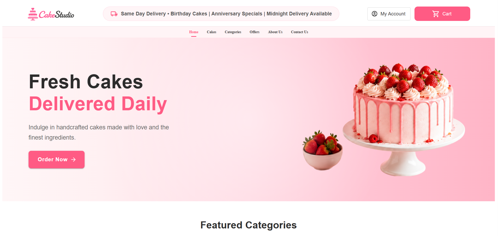

# 🎂 CakeStudio — Full-Stack Cake Ordering Platform

CakeStudio is a full-stack e-commerce web application for browsing, customizing, ordering, and managing cakes online.

The project is built using **ASP.NET Core Web API, React.js, Entity Framework Core, and SQL Server**. It includes secure authentication, guest and authenticated shopping flows, Stripe payment integration, order management, PDF invoice generation, background jobs, email notifications, and administrative functionality.

The project was designed not only as an e-commerce application, but also as a practical implementation of real-world backend concepts such as secure authentication, payment processing, webhook handling, role-based authorization, background processing, and layered application architecture.

---

## ✨ Key Features

### 👤 Authentication & Security

- User registration and login
- JWT-based authentication
- JWT access tokens stored in **Secure HttpOnly cookies**
- Refresh token rotation and revocation
- Role-based authorization for **Customer** and **Admin**
- Google authentication
- Forgot password flow
- OTP-based password operations
- Secure logout
- ASP.NET Core antiforgery protection
- CSRF token validation for state-changing requests
- CORS configuration for frontend/backend communication

The authentication implementation was designed so that authentication tokens are not directly accessible from frontend JavaScript.

---

### 🛒 Shopping & Cart

- Browse available cakes
- View cake details
- Add products to cart
- Increase/decrease quantities
- Remove products from cart
- Guest shopping cart using browser storage
- Server-side cart for authenticated customers
- Shipping address collection and validation
- Order summary and price calculation

Guest users can browse and build their cart without creating an account.

---

## 💳 Payments

CakeStudio supports multiple payment flows.

### Cash on Delivery

Customers can place orders using **Cash on Delivery (COD)** without going through an online payment gateway.

### Stripe Checkout

Stripe Checkout is integrated using **Stripe Test Mode** for portfolio/demo purposes.

The Stripe integration includes:

- Checkout Session creation
- Payment status tracking
- Payment success handling
- Payment failure handling
- Checkout expiration handling
- Stripe webhook processing
- Server-side payment verification
- Prevention of duplicate payment sessions
- Admin-initiated refunds
- Refund status synchronization through webhooks

> **Note:** Stripe runs in Test Mode in the deployed portfolio version. No real money is charged.

Payment status is updated primarily through trusted Stripe webhook events rather than relying only on frontend redirects.

---

## 📦 Order Management

- Create orders from checkout
- Maintain order items
- Track order status
- Track payment status
- COD and online payment support
- Customer order history
- Administrative order management
- Controlled order-status transitions
- Payment and order status synchronization

---

## 🧾 Invoice Generation

CakeStudio can generate PDF invoices for completed/delivered orders.

Features include:

- Server-side PDF generation
- Customer/order information
- Ordered item details
- Pricing information
- Secure invoice access
- Invoice email delivery
- Authorization checks before invoice download

Invoice access is restricted so that customers can access only their own eligible invoices, while administrators can perform authorized administrative operations.

---

## 📧 Email & Background Processing

The application includes email functionality for workflows such as account recovery and order/invoice communication.

Background jobs are handled using **Hangfire**, allowing work such as email processing to run outside the main HTTP request lifecycle.

---

## 🛡️ Security Highlights

Security was an important part of the project.

### HttpOnly Cookie Authentication

Instead of storing JWT access tokens in `localStorage` or `sessionStorage`, CakeStudio stores authentication tokens in cookies configured with security attributes such as:

```text
HttpOnly
Secure
SameSite
```

`HttpOnly` prevents frontend JavaScript from directly reading authentication tokens.

### CSRF Protection

Because browsers automatically attach cookies to eligible requests, the application also implements ASP.NET Core antiforgery protection.

For state-changing operations:

```text
POST
PUT
PATCH
DELETE
```

the frontend obtains an antiforgery token and sends it using:

```http
X-CSRF-TOKEN
```

The backend validates the request token together with its antiforgery cookie.

### Stripe Webhook Security

Stripe webhooks do not use browser CSRF protection because they are server-to-server requests.

Instead, webhook authenticity is verified using the **Stripe webhook signature**.

---

# 🏗️ Architecture

CakeStudio follows a layered backend structure.

```text
┌─────────────────────────────┐
│         React.js UI         │
└──────────────┬──────────────┘
               │
               │ HTTPS / REST API
               ▼
┌─────────────────────────────┐
│   ASP.NET Core Controllers  │
└──────────────┬──────────────┘
               │
               ▼
┌─────────────────────────────┐
│       Service Layer         │
│   Business Logic / Rules    │
└──────────────┬──────────────┘
               │
               ▼
┌─────────────────────────────┐
│      Repository Layer       │
│      Data Access Logic      │
└──────────────┬──────────────┘
               │
               ▼
┌─────────────────────────────┐
│       Entity Framework      │
└──────────────┬──────────────┘
               │
               ▼
┌─────────────────────────────┐
│         SQL Server          │
└─────────────────────────────┘

External Integrations
        │
        ├── Stripe
        ├── Google Authentication
        ├── Email Service
        ├── Hangfire
        └── PDF Generation
```

---

# 🛠️ Technology Stack

## Backend

- ASP.NET Core Web API
- C#
- Entity Framework Core
- SQL Server
- JWT Authentication
- ASP.NET Core Authorization
- ASP.NET Core Antiforgery
- Stripe .NET SDK
- Hangfire
- Playwright
- Dependency Injection
- Repository Pattern
- Service Layer Pattern

## Frontend

- React.js
- Vite
- JavaScript
- Material UI
- React Router
- Axios
- React Toastify

## Database

- Microsoft SQL Server
- Entity Framework Core

## External Services

- Stripe Checkout
- Google Authentication
- Email/SMTP services

---

# 🔐 Authentication Flow

```text
User Login
    │
    ▼
Credentials validated
    │
    ▼
Access Token + Refresh Token generated
    │
    ▼
Secure HttpOnly Cookies
    │
    ▼
Browser automatically sends cookie
    │
    ▼
ASP.NET Core JWT Middleware
    │
    ▼
Token validation
    │
    ▼
ClaimsPrincipal / HttpContext.User
    │
    ▼
[Authorize] / Role Authorization
```

The frontend retrieves the currently authenticated user's information through an authenticated `/Auth/me` endpoint rather than reading JWT contents directly from browser storage.

---

# 🔄 Refresh Token Flow

```text
Access Token Expires
        │
        ▼
API returns 401
        │
        ▼
Frontend requests token refresh
        │
        ▼
Refresh token read from HttpOnly cookie
        │
        ▼
Refresh token validated against database
        │
        ▼
Old refresh token revoked
        │
        ▼
New access + refresh tokens generated
        │
        ▼
New HttpOnly cookies created
        │
        ▼
Original request retried
```

Refresh-token rotation reduces the usefulness of an older refresh token after it has already been used.

---

# 🛡️ CSRF Protection Flow

```text
React Application
       │
       │ GET /api/Csrf/token
       ▼
ASP.NET Core
       │
       ├── Antiforgery Cookie
       │
       └── Request Token
                 │
                 ▼
              React
                 │
                 │ X-CSRF-TOKEN
                 ▼
         POST / PUT / DELETE
                 │
                 ▼
       ASP.NET Core validates
       Cookie + Request Token
```

This provides CSRF protection for state-changing browser requests while using cookie-based authentication.

---

# 💳 Stripe Payment Flow

```text
Customer Checkout
       │
       ▼
Order Created
       │
       ▼
Create Stripe Checkout Session
       │
       ▼
Redirect to Stripe Checkout
       │
       ▼
Customer completes test payment
       │
       ▼
Stripe
       │
       ├──────────────► Frontend success page
       │
       └──────────────► Backend webhook
                              │
                              ▼
                       Verify Stripe Signature
                              │
                              ▼
                       Update Payment Status
                              │
                              ▼
                         Update Order
```

The webhook is the trusted server-side mechanism for synchronizing Stripe payment events with application data.

---

# 💰 Refund Flow

Refund operations are restricted to authorized administrators.

```text
Admin
  │
  ▼
Refund API
  │
  ▼
Authorization Check
  │
  ▼
Stripe Refund
  │
  ▼
Stripe Webhook
  │
  ▼
Payment / Refund Status Updated
```

---

# 📁 Project Structure

A simplified structure of the application:

```text
CakeStudio/
│
├── Backend/
│   ├── Controllers/
│   ├── Application/
│   │   ├── Interfaces/
│   │   ├── Services/
│   │   └── DTOs/
│   │
│   ├── Infrastructure/
│   │   └── Repositories/
│   │
│   ├── Models/
│   └── Program.cs
│
└── Frontend/
    └── src/
        ├── components/
        ├── context/
        ├── pages/
        ├── services/
        └── routes/
```

> The exact folder structure may vary depending on the project version.

---

# ⚙️ Configuration

Sensitive configuration should **not** be committed to source control.

Typical configuration includes:

```text
Database connection string
JWT signing secret
Stripe secret key
Stripe webhook secret
Google authentication credentials
Email/SMTP credentials
```

For deployed environments, these values should be provided using environment variables or the hosting platform's secret-management functionality.

Example:

```text
StripeSettings__SecretKey
StripeSettings__WebhookSecret
ConnectionStrings__DefaultConnection
```

---

# 🚀 Running the Project Locally

## Backend

Restore packages:

```bash
dotnet restore
```

Run the ASP.NET Core API:

```bash
dotnet run
```

Example development API:

```text
https://localhost:7120
```

---

## Frontend

Install dependencies:

```bash
npm install
```

Start Vite:

```bash
npm run dev
```

Example development frontend:

```text
https://localhost:5173
```

The frontend uses HTTPS locally so that Secure cookies and antiforgery behavior can be tested in an environment closer to production.

---

# 🧪 Stripe Test Payments

The portfolio version uses **Stripe Test Mode**.

Use Stripe-provided test payment methods when testing checkout.

No real money should be used or charged through the demo environment.

---

# 📸 Screenshots

Add screenshots here after deployment.

Suggested screenshots:

1. Home / Cake Catalog
2. Product Details
3. Shopping Cart
4. Checkout
5. Stripe Checkout
6. Order Confirmation
7. Customer Orders
8. Admin Dashboard
9. Payment / Refund Management
10. Generated Invoice

Example:

```markdown


```

---

# 🌐 Live Demo

**Frontend:** Coming soon  
**API:** Coming soon

> The deployed application uses Stripe Test Mode for demonstration purposes.

---

# 📚 What I Learned

Building CakeStudio provided practical experience with:

- Designing REST APIs using ASP.NET Core
- Structuring applications using controller, service, and repository layers
- Entity Framework Core and SQL Server
- React frontend development
- Authentication and authorization
- JWT access and refresh token lifecycle management
- HttpOnly cookie authentication
- CSRF protection
- OAuth/Google authentication
- Payment gateway integration
- Stripe Checkout and webhooks
- Refund processing
- Background job processing
- PDF generation
- Email integration
- Guest versus authenticated user workflows
- Secure API design

One of the major security improvements made during development was migrating authentication tokens away from JavaScript-accessible browser storage to **Secure HttpOnly cookies**, followed by adding **CSRF protection** for state-changing requests.

---

# 🔮 Future Improvements

The current version focuses on demonstrating a complete full-stack e-commerce workflow.

Potential future improvements include:

- Automated unit and integration tests
- CI/CD pipeline
- Containerization with Docker
- Cloud deployment and monitoring
- Improved observability
- Additional performance optimization

---

# 👨‍💻 Author

**Dheeraj S.**

.NET Full-Stack Developer

Technologies: **C# | ASP.NET Core | EF Core | SQL Server | React.js**

---

## ⭐ About This Project

CakeStudio was built as a portfolio project to demonstrate practical full-stack development beyond basic CRUD operations.

The project focuses particularly on:

**secure authentication, authorization, payment processing, webhooks, background jobs, database integration, frontend/backend communication, and real-world application workflows.**